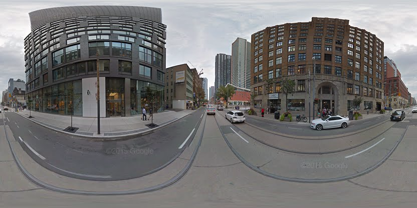

# extract-streetview

[](http://github.com/badges/stability-badges)

> :warning: This tool is experimental. :warning:

A command-line tool to extract high-res spherical images and other data from Google StreetView.

```sh
extract-streetview 43.6473963,-79.3923407 > panorama.png
```

Example of some output images:


## Install

This tool uses Electron for proper interaction with the Google API, so it is fairly heavy (~100mb). Install with latest [npm](https://www.npmjs.com/).

```sh
npm install extract-streetview -g
```

## Examples

With default settings:

```sh
extract-streetview 43.6473963,-79.3923407 > panorama.png
```



Other examples:

```sh
# high-res street view
extract-streetview 43.6473963,-79.3923407 --zoom 4 > panorama.png

# search outdoor results only
extract-streetview 43.6473963,-79.3923407 --source outdoor > panorama.png

# random cool panorama
extract-streetview -o image.png

# geolocate to current position
extract-streetview current -o myStreet.png
```

## Usage

[](https://www.npmjs.com/package/extract-streetview)

```txt
Usage:
  extract-streetview [lat,lng] [opts]

Options:
  --output, -o      image output path
  --zoom, -z        zoom level (quality), can be 0-4 or "max"
  --radius, -r      search radius in meters, default 50
  --preference, -p  search preference, "nearest" or "best" (default)
  --source, -s      photo source, "outdoor" or "default"
  --format, -f      output format, "jpg" or "png" (default)
  --quality, -q     encoding quality for JPG, default 0.9
  --id              the first argument is a panoID instead of lat,lng
```

Extracts a street view panorama from `[ latitude, longitude ]` input (or `google.com/maps/` URL). If not specified, will extract a random [Awesome StreetView](https://github.com/Jam3/awesome-streetview). 

You can also specify `"current"` as the location, and it will use the browser's geolocation API to determine your latitude/longitude.

If no `--output` is given, the PNG is written to stdout.

## License

MIT, see [LICENSE.md](http://github.com/Jam3/extract-streetview/blob/master/LICENSE.md) for details.
